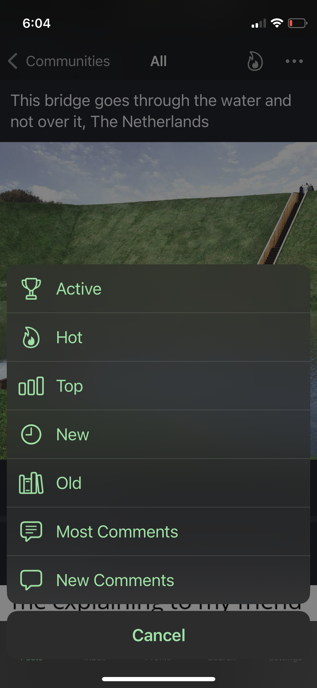
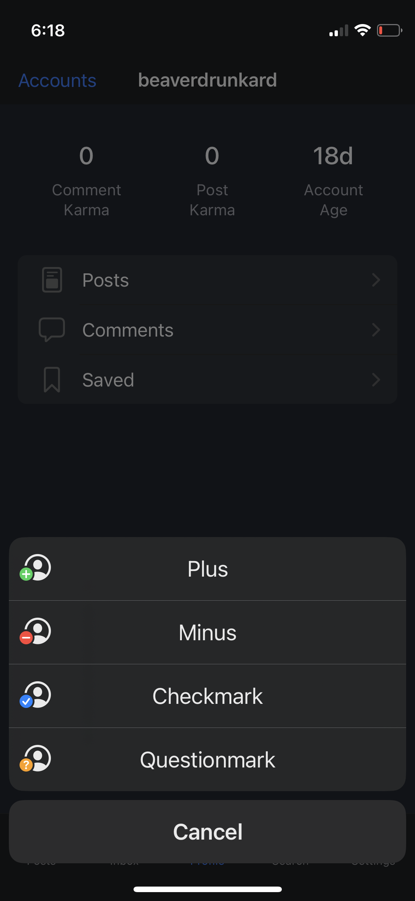

# react-native-sf-action-sheet (WIP)

> This is a custom ActionSheetIOS, with a possibility to display SF Symbols, change menu item colors and text alignment

[](https://shields.io/)
<p float="left">
  
  
</p>

## Getting started

```bash
npm install https://github.com/gaauwe/react-native-sf-action-sheet --save
```

or

```bash
yarn add https://github.com/gaauwe/react-native-sf-action-sheet
```
_Don't forget to run `cd ios && pod install && cd ..` after that !_


### Manual installation

#### iOS

1. In XCode, in the project navigator, right click `Libraries` ➜ `Add Files to [your project's name]`
2. Go to `node_modules` ➜ `react-native-sf-action-sheet` and add `RNSfActionSheet.xcodeproj`
3. In XCode, in the project navigator, select your project. Add `libRNSfActionSheet.a` to your project's `Build Phases` ➜ `Link Binary With Libraries`
4. Run your project (`Cmd+R`)<

## Usage

```jsx
import React from 'react';
import { Button, StyleSheet, View } from 'react-native';
import SfActionSheet from 'react-native-sf-action-sheet';

export default function App() {
  const openSfActionSheet = () => {
    SfActionSheet.showActionSheetWithOptions({
      cancelButtonIndex: 3,
      tintColor: '#8BE2A0',
      options: [
        {
          id: 'active',
          title: 'Active',
          icon: {
            name: 'trophy',
          },
        },
        {
          id: 'hot',
          title: 'Hot',
          icon: {
            name: 'flame',
          },
        },
        {
          id: 'topAll',
          title: 'Top',
          icon: {
            name: 'chart.bar',
          },
        },
        {
          title: 'Cancel',
        },
      ],
    }, ({ id, buttonIndex }) => console.log('Result:', id, buttonIndex));
  };

  return (
    <View style={styles.container}>
      <Button title="Call SfActionSheet" onPress={openSfActionSheet} />
    </View>
  );
}

const styles = StyleSheet.create({
  container: {
    flex: 1,
    justifyContent: 'center',
  },
});
```

## Props

### title
The title of the option.

### titleTextAlignment
The alignment of the text.

```
0
1
```
### titleTextColor
The color of the text.

###
### icon
#### name

The symbol name you want to display, can be seen in the [SF Symbols application](https://developer.apple.com/sf-symbols/).

#### color (optional)

The color of the symbol written as a hex or color value. PlatformColor and DynamicColorIOS also works.

#### weight (optional)

The (font) weight of the symbol.

```
ultralight
light
thin
regular
medium
semibold
bold
heavy
```

Multicolor has issues with this "thin" weight.

#### scale (optional)

The scale of the symbol, it will optimise the thickness of detail strokes in the icon for different sizes.

```
small
medium
large
```

#### multicolor (optional)

Enable multicolor, don't pass a "color" for it to work properly.

#### size (optional)

Font size of the icon as a number.

## Credits
Could not have done this without the inspiration of the following libraries:
* react-native-icon-action-sheet - [dxaraujo](https://github.com/dxaraujo/react-native-icon-action-sheet)
* react-native-sfsymbols - [birkir](https://github.com/birkir/react-native-sfsymbols)
